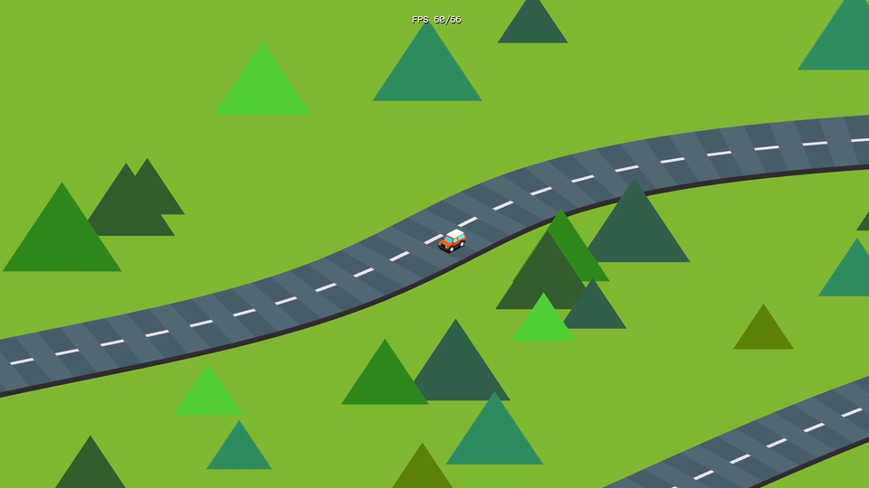
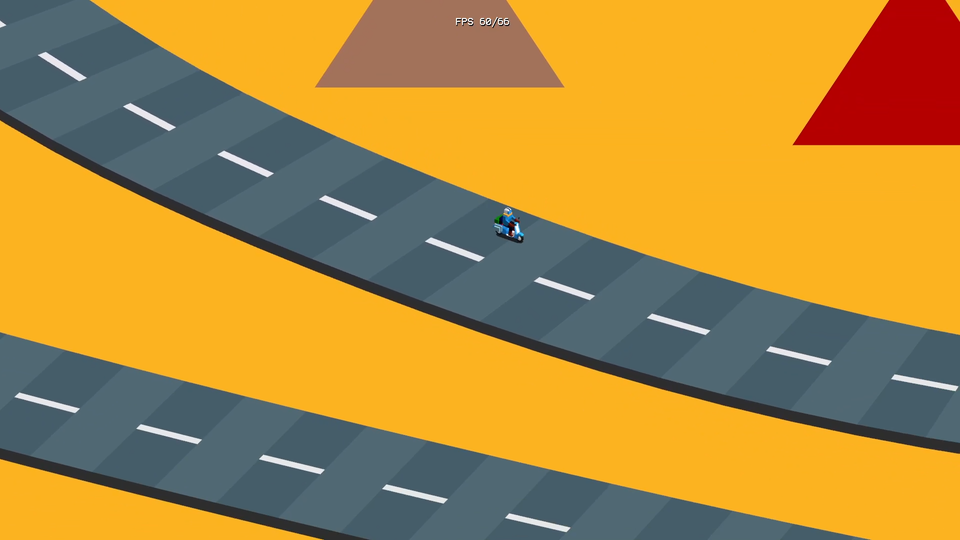
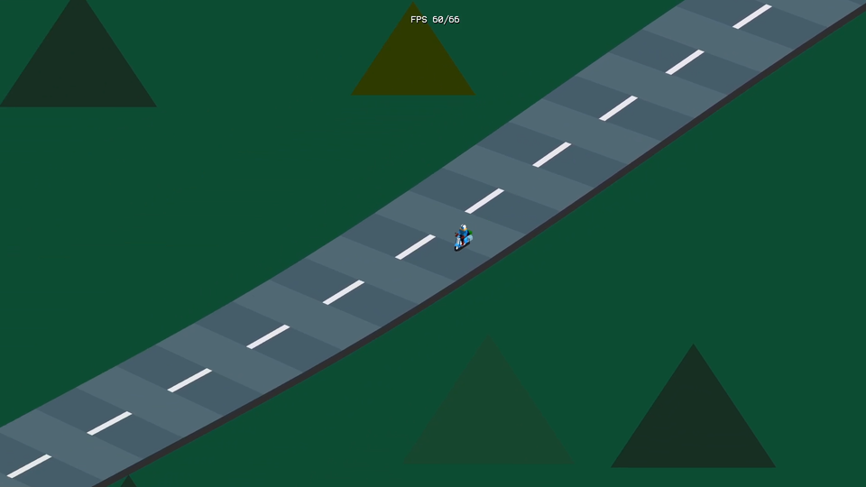

ssisoroadgl
===========

Screensaver for Windows that draws roads with isometrics implemented in C++ and OpenGL.

Screenshots
-----------


[01summer.png](./screenshots/01summer.png)


[02autumn.png](./screenshots/02autumn.png)


[03winter.png](./screenshots/03winter.png)


[04night.png](./screenshots/04night.png)

[Movie (YouTube)](https://youtu.be/ftjIspq6O30)

Install
-------

Copy 1 files to Windows system folder.

* ssisoroadgl.scr

```
Windows 64bit : C:\Windows\SysWOW64\
Windows 32bit : C:\Windows\System32\
```

The screen saver name is "ISO Road GL".

The settings are saved in an ini file.

```
%APPDATA%\ssisoroadgl\ssisoroadgl.ini

Windows10 : C:\Users\(USERNAME)\AppData\Roaming\ssisoroadgl\ssisoroadgl.ini
```

### Extra

ssisoroadglfw.exe is a demonstration program that draws almost as well as this screen saver. Using GLFW.

* F key : Change framerate. 60, 30, 20 FPS.
* T key : Toggle FPS display.
* ESC or Q key : Exit

Uninstall
---------

Delete files.

```
C:\Windows\SysWOW64\ssisoroadgl.scr
(or C:\Windows\System32\ssisoroadgl.scr)

%APPDATA%\ssisoroadgl\ssisoroadgl.ini
%APPDATA%\ssisoroadgl
```

Build Requirement / Environment
-------------------------------

### Build ssisoroadgl.scr

* Windows10 x64 22H2
* MinGW (g++ 6.3.0)
* windres 2.28 (in binutils package)
* GNU Make 3.81

```
cd src
make clean
make
```

### Build ssisoroadglfw.exe

#### Windows10 x64 22H2

* MSYS2 (g++ 13.2.0)
* GLFW 3.4 (mingw-w64-i686-glfw or mingw-w64-x86_64-glfw)
* GNU Make 4.4.1

```
cd src
make -f Makefile.glfw clean
make -f Makefile.glfw

./ssisoroadglfw.exe
```

#### Ubuntu Linux 22.04 LTS / 20.04 LTS

* g++ 11.4.0 / g++ 9.4.0
* libglfw3-dev 3.3.6-1 / 3.3.2-1
* GNU Make 4.3 / 4.2.1
 
```
cd src
make -f Makefile.glfw clean
make -f Makefile.glfw

./ssisoroadglfw
```

Author
------

[mieki256](https://github.com/mieki256)

License
-------

mieki256が書いた部分(render.cpp)、及び、作成したモデルデータ(scooter.obj, scooter.mtl)は、CC0 / Public Domain 扱いということで…。

Reference
---------

[How to Scr: Writing an OpenGL Screensaver for Windows](http://www.cityintherain.com/howtoscr.html)

Resource
--------

### Fonts

* [ProFont for Windows, for Macintosh, for Linux](https://tobiasjung.name/profont/)
* [shinonome font family](http://openlab.ring.gr.jp/efont/shinonome/)
* [Terminus Font Home Page](https://terminus-font.sourceforge.net/)
* [pet2015 font](http://blawat2015.no-ip.com/~mieki256/diary/202310301.html#202310301)

### Model data

* [Car Kit | OpenGameArt.org](https://opengameart.org/content/car-kit)

